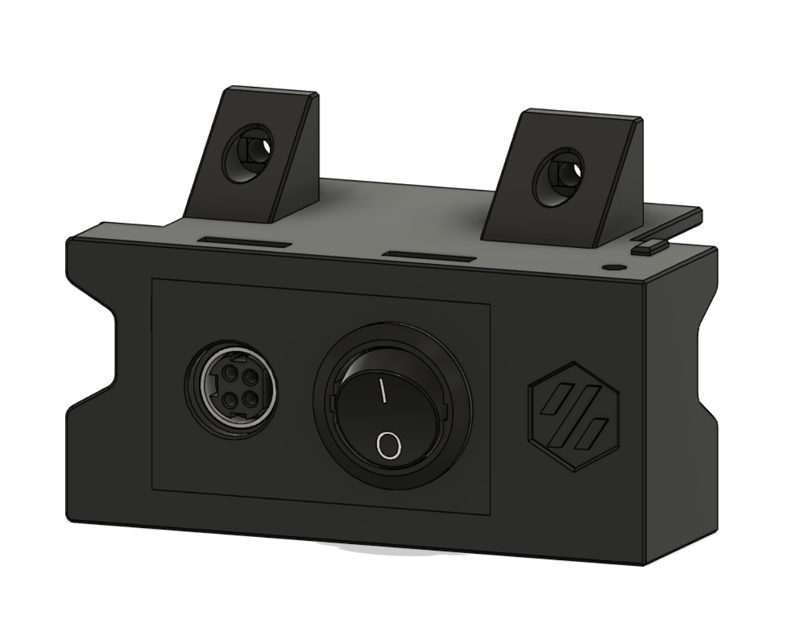
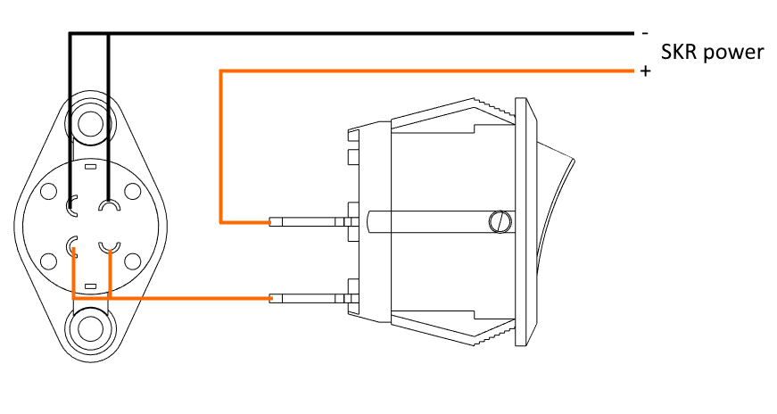
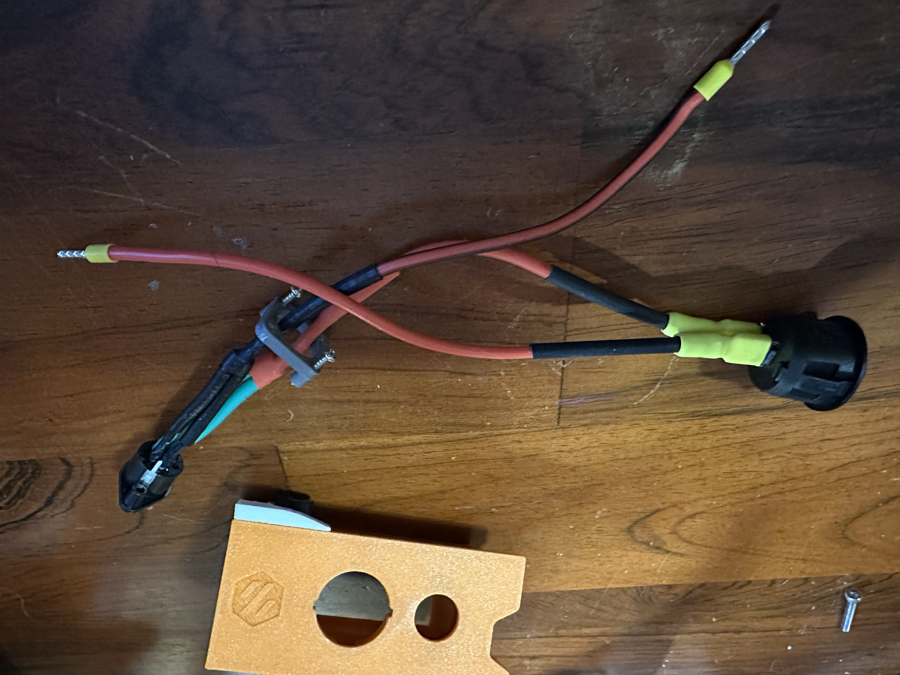
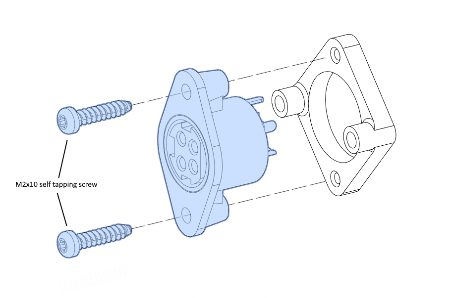
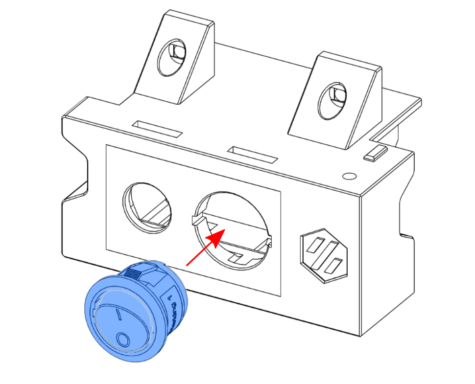
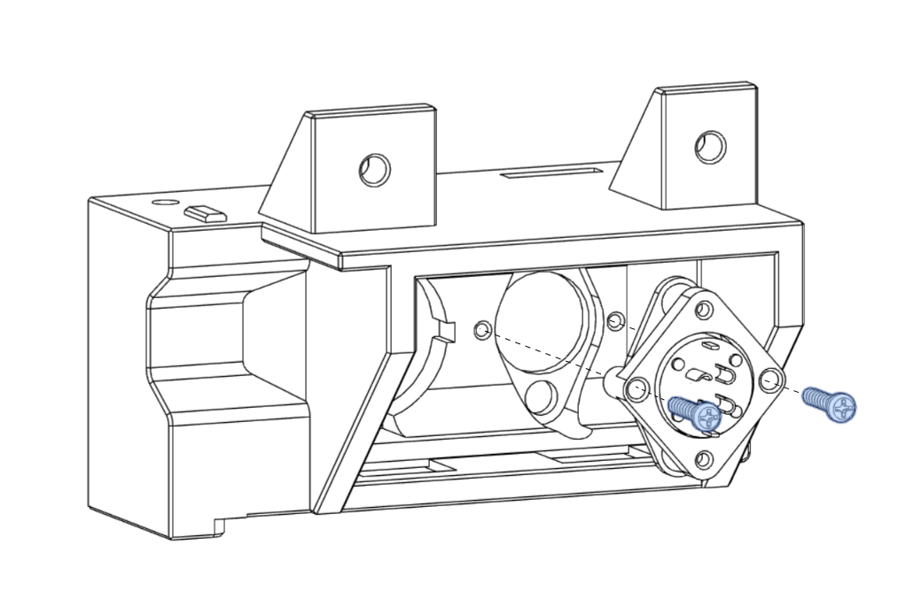
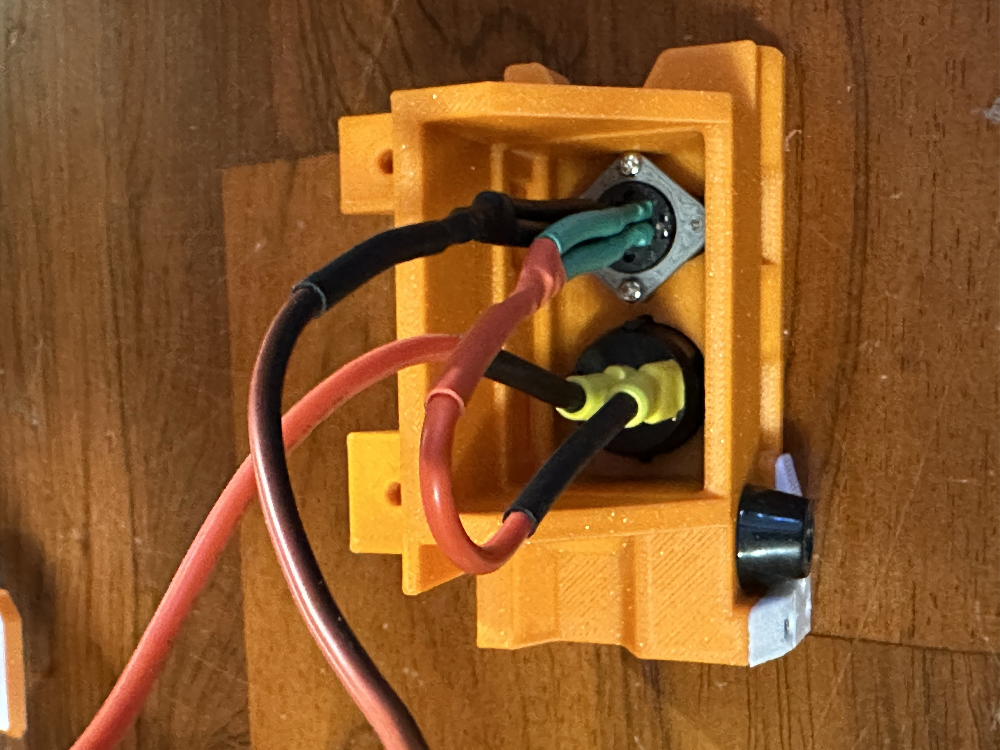

# Voron V0.2 DC Inlet Foot

Replaces the mains inlet foot part in the V0.2 to allow for the use of an external DC power supply (and consequently a 24V bed heater, since you no longer have mains power on the printer). This is based on the ["Voron 0 DC inlet" mod by arkeet](https://github.com/VoronDesign/VoronUsers/tree/master/printer_mods/arkeet/v0-dc-inlet).

## BOM
- Kycon KPJX-PM-4S connector ([Digi-Key](https://www.digikey.com/en/products/detail/kycon-inc/KPJX-PM-4S/9990081))
- Mean Well GST163A24-R7B power supply ([Digi-Key](https://www.digikey.com/en/products/detail/mean-well-usa-inc/GST160A24-R7B/7703602))
- Power switch, 20mm round, rated for at least 7A at 24VDC ([Digi-Key](https://www.digikey.com/en/products/detail/w-rth-elektronik/471002268142/9950821))
- 2x quick disconnect terminal for power switch ([Digi-Key](https://www.digikey.com/en/products/detail/te-connectivity-amp-connectors/2-520194-2/289254))
- 24V 60W bed heater ([Keenovo](https://keenovo.store/collections/standard-keenovo-silicone-heaters/products/keenovo-square-silicone-heater-3d-printer-build-plate-heatbed-heating-pad?variant=33194097803404))
- 4x M2x10 self-tapping screw
- 18AWG wire
- Heatshrink tubing

## Instructions

1. Solder the wires between the Kycon connector and the switch prior to installation. Use the quick-connect terminals on the switch side. Be sure to install heat-shrink tubing over all exposed areas (see figures 2 & 3). Also ensure that the inlet bracket is in place before soldering the connector!
2. Route the bracket, connector, and wires through the switch opening in the DC inlet foot. Don't screw the bracket to the connector until after you've run them through the switch opening -- the connector is a tight fit but if you angle it correctly it will go through! 
3. Screw the inlet bracket to the connector (see figure 4).
4. Snap the switch into place (see figure 5).
5. Screw the inlet bracket into the inlet foot (see figure 6).
6. Connect the switch to your controller board's 24DC in.

## Figures

